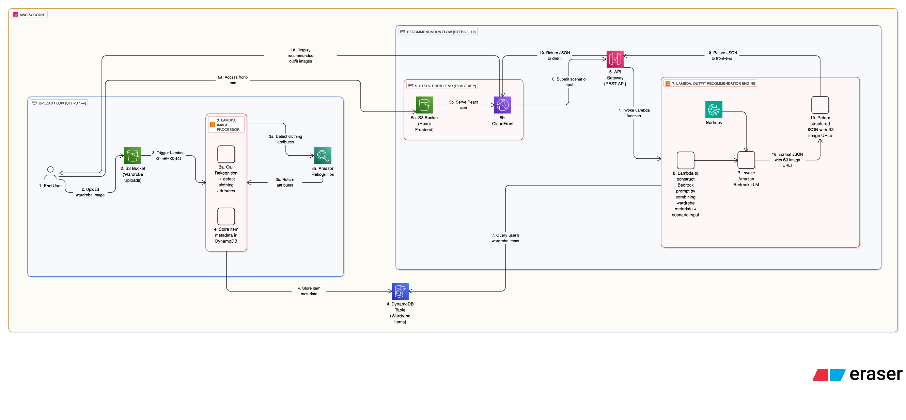

## CluelessStyleMatcher – Problem, Solution & Cost Analysis

### Problem Statement

Most users struggle to organise outfits, understand what items match, or choose suitable clothing for specific events or weather conditions (I know I sometimes do!). Existing fashion apps often rely on manual tagging, inconsistent styling rules, or generic recommendations that fail to integrate with a user’s actual wardrobe.

**CluelessStyleMatcher addresses this by providing an automated, serverless, AI-powered outfit recommendation system.**

---

### Solution Design

CluelessStyleMatcher uses an entirely serverless architecture on AWS to analyse wardrobe images, store structured metadata, and generate personalised outfit recommendations based on user-defined scenarios.

The workflow is split into two flows:

#### **1. Upload Flow – Automated Wardrobe Processing**

Users upload wardrobe images to an S3 bucket. An AWS Lambda function triggers automatically, calling Amazon Rekognition to detect attributes such as:

- Colour
- Style
- Material
- Garment Type

Extracted metadata is written to DynamoDB, forming a structured, scalable wardrobe database.

#### **2. Recommendation Flow – AI-Powered Outfit Suggestions**

When a user requests an outfit scenario (e.g., _“sunny Barcelona trip”_, _“winter commute”_, _“birthday dinner”_), the front-end (S3 + CloudFront) calls an API hosted on API Gateway.

A Lambda function retrieves wardrobe metadata from DynamoDB, constructs a prompt, and sends it to Amazon Bedrock to generate:

- A natural-language explanation
- A list of selected wardrobe items
- Optional styling notes or colour-matching guidance

The response is returned to the static site, where the user can visualise the recommended outfit.

**The design prioritises simplicity, low cost, automatic scaling, and minimal operational overhead—ideal for a single engineer or SME fashion-tech prototype.**

_The diagram below shows the high-level architecture of CluelessStyleMatcher, including both the **Upload Flow** and **Recommendation Flow**._

---

### Cost Analysis

CluelessStyleMatcher is intentionally designed to be extremely low-cost while still providing high-quality AI-driven recommendations.

The primary cost drivers are:

1. **Amazon S3 Storage**  
   Inexpensive storage for wardrobe images. Costs scale linearly with usage but remain low for SMEs and prototypes.

2. **Lambda Functions**  
   All compute is serverless and billed per millisecond. For typical usage patterns, monthly compute costs remain small.

3. **Amazon Rekognition**  
   Costs apply per image analysed. Wardrobe images are usually limited, so monthly spend remains predictable.

4. **Amazon Bedrock Inference**  
   The main cost component. Usage is event-driven (on-demand recommendations), enabling full cost control.

5. **DynamoDB Storage & Reads**  
   Minimal cost due to small item sizes and low throughput requirements.

Because infrastructure scales automatically and avoids traditional servers, **CluelessStyleMatcher provides an AI-capable solution at a fraction of the price of a traditional hosted application**. Costs can be controlled tightly by limiting image ingestion or capping Bedrock requests.

Overall, the architecture delivers a **highly cost-efficient, production-ready platform** suitable for fashion-tech SMEs, or for personal usage!

---
